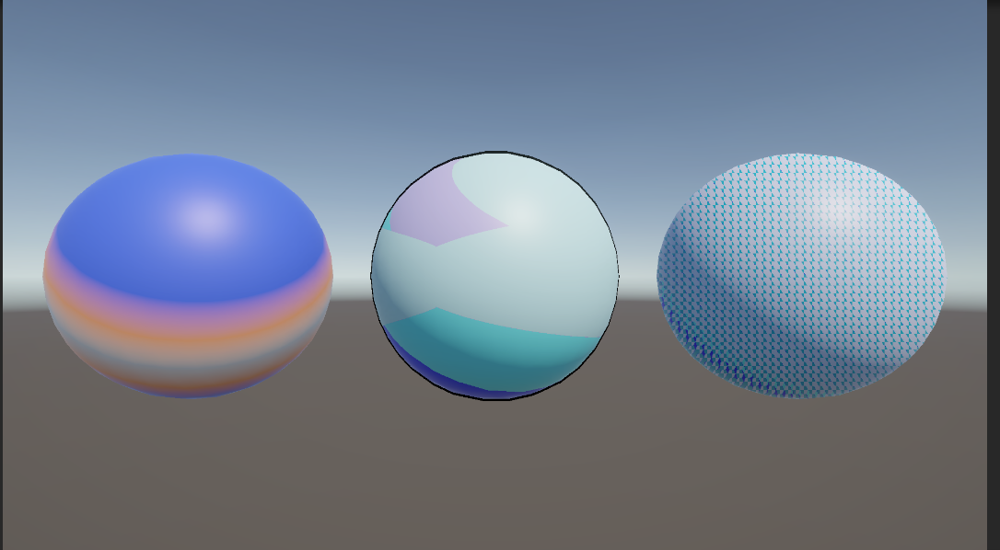

# はじめに
プログラムワークショップIVの管理用です

# 結果画像

- 工夫した点：RampShaderではTriangleWaveでグラデーションの仕方を変化せ、ToonShaderではAddとEllipseを追加してグラデーションに楕円を加えて見た目がどう変化するのか試した。
  また、HalftoneShaderではsinだけでなくcosやtangentとそれぞれをmultiplyで合わせてみたものなどを試した。画像のものはsinとtangentを合わせたものである

# 進め方

- 本リポジトリをforkしてください
- fork先のリポジトリを更新してください
- Unityのプロジェクトをsrc内で進めてください
- 結果を画面キャプチャして、画像としてリポジトリに追加して、上記のリンクから見られるようにしてください
- 完成したら本リポジトリのmainブランチにpull requestを投げてください
